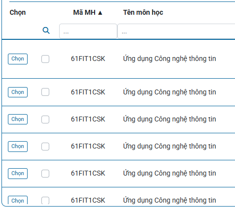
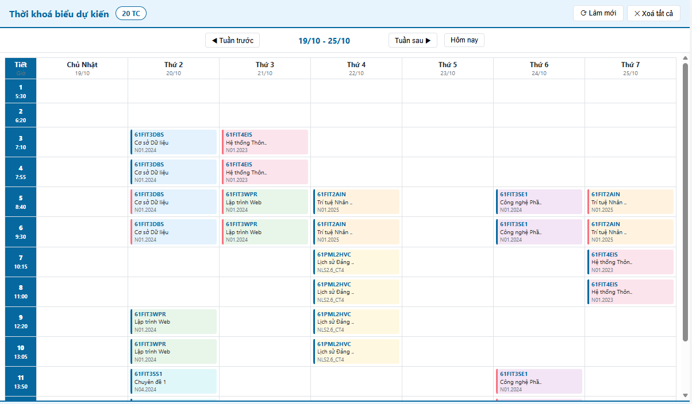
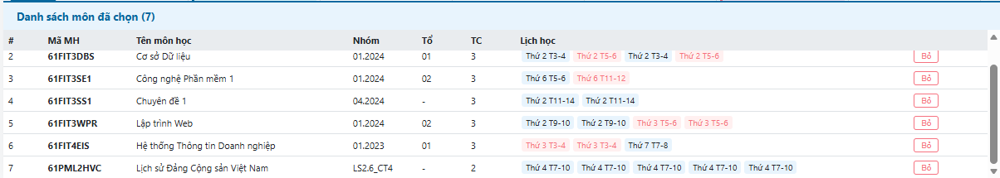
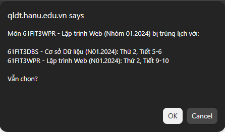

# 🎓 HANU TKB Preview

> Chrome Extension giúp sinh viên Đại học Hà Nội xem trước thời khoá biểu và phát hiện trùng lịch trước khi đăng ký môn học.

[](https://qldt.hanu.edu.vn)
[](https://developer.chrome.com/docs/extensions/mv3/intro/)
[](LICENSE)

---

## 📸 Ảnh chụp màn hình

| Trang đăng ký môn học | Tab thời khoá biểu |
|:---:|:---:|
|  |  |

<details>
<summary>📸 Xem thêm ảnh</summary>

| Danh sách môn đã chọn | Cảnh báo trùng lịch |
|:---:|:---:|
|  |  |

</details>

---

## ✨ Tính năng

- **🔘 Chọn môn trực tiếp** — Inject nút "Chọn" vào bảng đăng ký môn học, hoạt động kể cả ngoài giờ đăng ký
- **📅 Xem TKB dạng tuần** — Grid 7 ngày × 14 tiết, có giờ bắt đầu mỗi tiết theo quy định của trường
- **🗓️ Điều hướng tuần** — Mũi tên chuyển tuần, lọc môn học theo tuần được chọn, nút "Hôm nay"
- **⚠️ Phát hiện trùng lịch** — Tự động phát hiện & cảnh báo khi chọn 2 môn cùng thứ + cùng tiết
- **🚫 Chặn đăng ký trùng** — Hiện popup confirm trước khi chọn môn bị trùng lịch
- **📋 Danh sách chi tiết** — Bảng liệt kê đầy đủ mã MH, tên môn, nhóm, tổ, tín chỉ, lịch học
- **💾 Persistent** — Lưu danh sách môn đã chọn, khôi phục sau khi tắt/mở lại trình duyệt
- **⚡ Real-time** — Tab TKB tự động cập nhật ngay khi chọn/bỏ chọn môn

---

## 🚀 Cài đặt

### Từ mã nguồn (Developer Mode)

1. **Tải mã nguồn**
   ```bash
   git clone https://github.com/haxvzje/hanu-tkb-preview.git
   ```

2. **Mở Chrome Extensions**
   - Vào `chrome://extensions`
   - Bật **Developer mode** (góc phải trên)

3. **Load extension**
   - Bấm **Load unpacked**
   - Chọn thư mục `hanu-tkb-extension/`

4. **Sử dụng**
   - Vào https://qldt.hanu.edu.vn/public/#/dangkymonhoc
   - Cột "Chọn" sẽ tự động xuất hiện cạnh mỗi môn học
   - Bấm icon extension trên toolbar để mở tab TKB

---

## 📖 Hướng dẫn sử dụng

### Chọn môn học

1. Truy cập trang [Đăng ký môn học](https://qldt.hanu.edu.vn/public/#/dangkymonhoc) (cần đăng nhập)
2. Bấm nút **Chọn** cạnh mỗi môn muốn preview
3. Nếu môn bị trùng lịch với môn đã chọn → popup cảnh báo → chọn **OK** để vẫn thêm hoặc **Cancel** để bỏ qua

### Xem thời khoá biểu

1. Bấm icon  trên Chrome toolbar
2. Tab mới mở ra hiển thị:
   - **Grid TKB** — 7 cột (Thứ 2 → Chủ Nhật) × 14 tiết, mỗi ô hiển thị mã MH + tên môn + nhóm
   - **Thanh điều hướng** — ◀ / ▶ chuyển tuần, nút Hôm nay
   - **Danh sách môn** — Bảng chi tiết các môn đã chọn kèm nút Bỏ
   - **Cảnh báo trùng lịch** — Thanh đỏ hiển thị các vị trí bị trùng

### Quản lý danh sách

- **Bỏ chọn 1 môn** — Bấm nút "Bỏ" cạnh môn trên trang đăng ký, hoặc bấm "Bỏ" trong danh sách TKB
- **Xoá tất cả** — Bấm nút "✕ Xoá tất cả" trên tab TKB
- **Làm mới** — Bấm "⟳ Làm mới" để đồng bộ lại từ trang đăng ký

---

## 🏗️ Kiến trúc

```
┌─────────────────────────────┐     ┌──────────────────────┐
│   Trang đăng ký môn học      │     │   Tab TKB Preview     │
│   (qldt.hanu.edu.vn)        │     │   (chrome-extension)   │
│                              │     │                       │
│  ┌──────────────────────┐   │     │  ┌─────────────────┐  │
│  │    content.js        │   │     │  │   popup.js      │  │
│  │                      │   │     │  │                  │  │
│  │ • Inject nút Chọn    │   │     │  │ • Render grid   │  │
│  │ • Parse schedule     │   │     │  │ • Week nav      │  │
│  │ • Conflict check     │   │     │  │ • Course list   │  │
│  │ • MutationObserver   │   │     │  │ • Conflict bar  │  │
│  └──────┬───────────────┘   │     │  └────────┬────────┘  │
│         │                    │     │           │           │
│         │  chrome.storage    │     │           │ storage   │
│         │  .local            │◄────┼───────────┤ .onChanged│
│         │                    │     │           │           │
│  ┌──────┴───────────────┐   │     │  ┌────────┴────────┐  │
│  │     background.js    │   │     │  │   popup.html    │  │
│  │  • Badge counter     │   │     │  │   popup.css     │  │
│  │  • Open tab on click │   │     │  └─────────────────┘  │
│  └──────────────────────┘   │     │                       │
└─────────────────────────────┘     └───────────────────────┘
```

**Data flow:** `content.js` parse DOM → lưu `Map` in-memory → sync `chrome.storage.local` → `popup.js` nhận real-time qua `storage.onChanged` → render TKB + danh sách.

---

## 📁 Cấu trúc dự án

```
hanu-tkb-extension/
├── manifest.json          # Chrome MV3 manifest
├── background.js          # Service worker: badge + mở tab
├── content.js             # Content script: inject UI + parse data
├── popup/
│   ├── popup.html         # Tab TKB giao diện
│   ├── popup.js           # Render grid + danh sách + điều hướng tuần
│   └── popup.css          # Style khớp theme HANU (#07689F)
├── icons/
│   ├── icon16.png
│   ├── icon48.png
│   └── icon128.png
├── screenshots/           # Ảnh chụp màn hình cho README
├── README.md
└── LICENSE
```

---

## 🛠️ Công nghệ

| Thành phần | Công nghệ |
|-----------|----------|
| Extension | Chrome Manifest V3 |
| Ngôn ngữ | Vanilla JavaScript (ES2020+) |
| Styling | CSS thuần (không framework) |
| Storage | `chrome.storage.local` |
| Giao tiếp | `chrome.runtime.sendMessage` + `chrome.tabs.sendMessage` |
| DOM parsing | MutationObserver + class-based selectors |
| Dependencies | **0** — không thư viện ngoài |

---

## 🔧 Phát triển

### Debug

1. **Content script:** Mở DevTools (F12) trên trang qldt → tab Console → log bắt đầu bằng `[HANU]`
2. **Tab TKB:** Mở DevTools (F12) trên tab TKB → tab Console → log `[HANU Tab]`
3. **Background:** Vào `chrome://extensions` → bấm "Service Worker" của extension → mở DevTools riêng

### Cấu trúc schedule

Schedule text trong DOM:
```
Thứ 4,tiết 5-&gt;6,09/09/26 đến 25/11/26
Thứ 7,tiết 5-&gt;6,19/09/26 đến 05/12/26(TH)
```

- `(TH)` = Thực hành, không có = Lý thuyết
- Phân cách bởi thẻ `<hr>`
- Ngày: `Thứ 2-7`, `Chủ nhật`

### Selector chính

| Target | Selector |
|--------|----------|
| Bảng đăng ký | `table.table-dk` |
| Cell thời khoá biểu | `td.tkb, td.col_400` |
| Row đã chọn | `tr[data-hanu-selected="true"]` |
| Nút chọn (injected) | `button.hanu-btn` |

---

## 📋 Roadmap

- [ ] Đồng bộ với TKB chính thức (`#/tkb-tuan`)
- [ ] Export TKB ra ảnh / PDF
- [ ] Hỗ trợ nhiều học kỳ cùng lúc
- [ ] Hiển thị thông tin giảng viên, phòng học
- [ ] Đăng tải lên Chrome Web Store
- [ ] Tính năng tự động xếp TKB tối ưu

---

## 👤 Tác giả

Phát triển bởi [@haxvzje](https://github.com/haxvzje)

---

## 📄 License

MIT License — xem [LICENSE](LICENSE) để biết thêm chi tiết.
